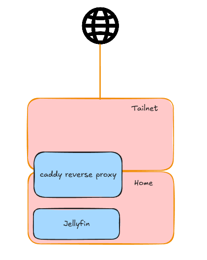
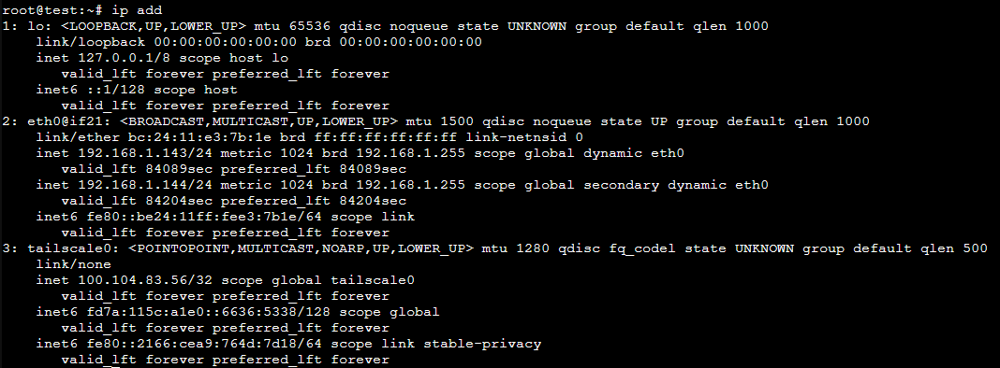
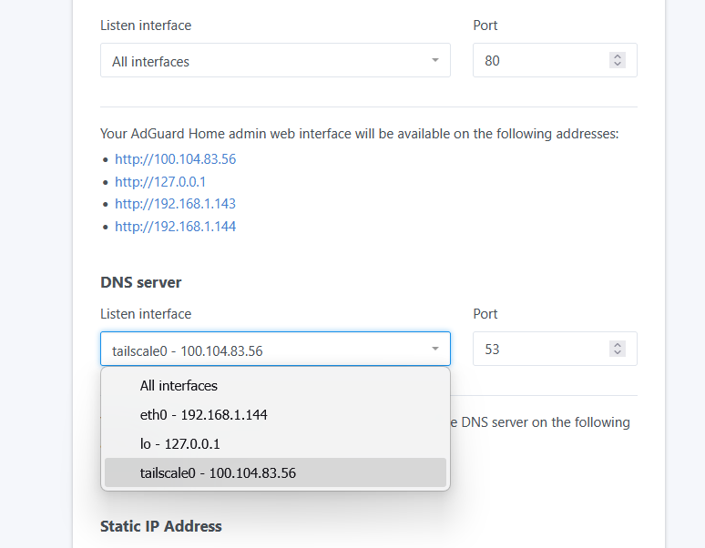
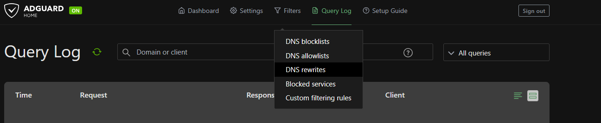
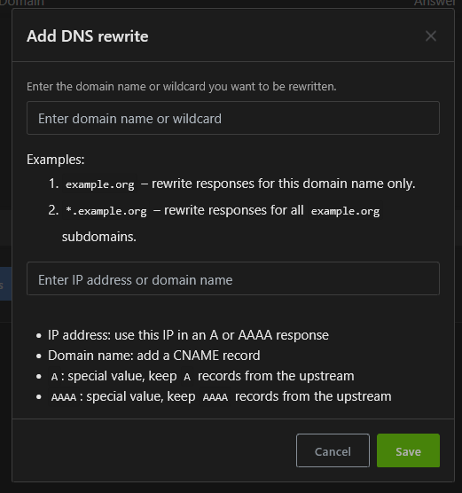

# Intro

Alright here goes my first post yayyyy. So in this first post of mine, I'm gonna be doing Tailscale DNS Resolution, so that I can have a reverse proxy over tailscale, wiht CNAME involved. 


This is the network diagram I wish to achieve, with caddy being the reverse proxy, and my phone being able to access jellyfin through caddy. Originally, Tailscale has [magicDNS](https://tailscale.com/docs/reference/dns-in-tailscale?q=dns), but it only creates for 1 dns for each host machine. With a restricted nameserver, I will be able to configure my own CNAME records, to point towards caddy as a reverse proxy. 

# Configuration

Following [this documentation](https://tenekev.com/posts/internal-dns-for-your-tailscale-network/), I copied it and it work
I am doing all services on 1 machine, as I feel theres little to no impact splitting the services. Adguard and Caddy are the 2 services I will be using, and this post will be about Adguard specifically.

## Step 1: Install Tailscale
Spin up your machine, and install Tailscale on the machine. I am using `ubuntu-22.04-standard_22.04-1_amd64.tar.zst` LXC container on proxmox, and used the included bash shell from [Tailscale](https://tailscale.com/docs/install/linux) to download Tailscale onto the machine.
```sh
curl -fsSL https://tailscale.com/install.sh | sh
```

After installing tailscale, authenticate your machine by doing 
```sh
sudo tailscale up --accept-dns=false
```
The flag `--accept-dns` prevents Tailscale from pushing the default DNS configuration from the admin console onto your machine. Basically saying its on its own for DNS lookups. As this machine will be the DNS server for the tailnet, it makes sense to not have the default DNS configuration, or else there would be a conflict in terms of DNS resolution.

> If the container you are using is a LXC, there are chances that `/dev/net/tun` is not enabled in your container, as it is an unprivelged one. To counter this, run `pct set <containerID> --dev0 /dev/net/tun` to let `/dev/net/tun` passthrough.
{: .prompt-info }

After configuring the tailscale authentication, doing a `ip add` on caddy will show the IP address of tailscale. In this case it is 100.104.83.56


## Step 2: Install AdGuardHome

Installation [site](https://adguard-dns.io/kb/adguard-home/getting-started/). Go to release page and copy the link to binary. To download directly into the container, you can use `curl -OL <site>` in your container to download to the current directory. After downloading, `tar -xf <file>` to untar the file. 

```
curl -OL <site>
tar -xf AdGuardHome_linux_arm64.tar.gz
cd AdGuardHome
./AdGuardHome
```
When it comes to Listen interface for DNS Server, point it towards tailscale interface. Then proceed as usual.
> You can change the port number to access AdGuardHome to another other than the default, in the event theres a port mismatch due to other services running on your machine. I chose 5353
{: .prompt-info }



## Step 3: Configuring AdGuardHome

After installing, comes configuring. Go over to Filters > DNS rewrites > Add DNS rewrite. This allows to create translations for the reverse proxy lookup.



To rewrite the domain, I used wildcard, to point towards my reverse proxy machine, since all translation is done through 1 machine. For small configurations, you can use the exact name, since there won't be much of a difference. Wildcard would be scalable in the future as there is no need to re-declare a translation everytime you set one.

*.jdstyle.ts
Point the IP to the reverse proxy machine IP, in this case, would be 100.104.83.56. 
And you should be set! ... for the local part.

## Step 4: Configuring Tailscale DNS

Finally would be the tailscale configurations. This part of configuration would take place in the Tailscale admin console. 

Tailscale Admin Console > DNS > Nameservers

Add a custom nameserver, with the IP address of the AdGuardHome **Tailscale** IP address. Enable Split tunneling and enter the domain you configured. In this post, it is jdstyle.ts. 

After this, test your connection on another machine, and check if youre able to access the reverse proxy. 

Happy configuring!
